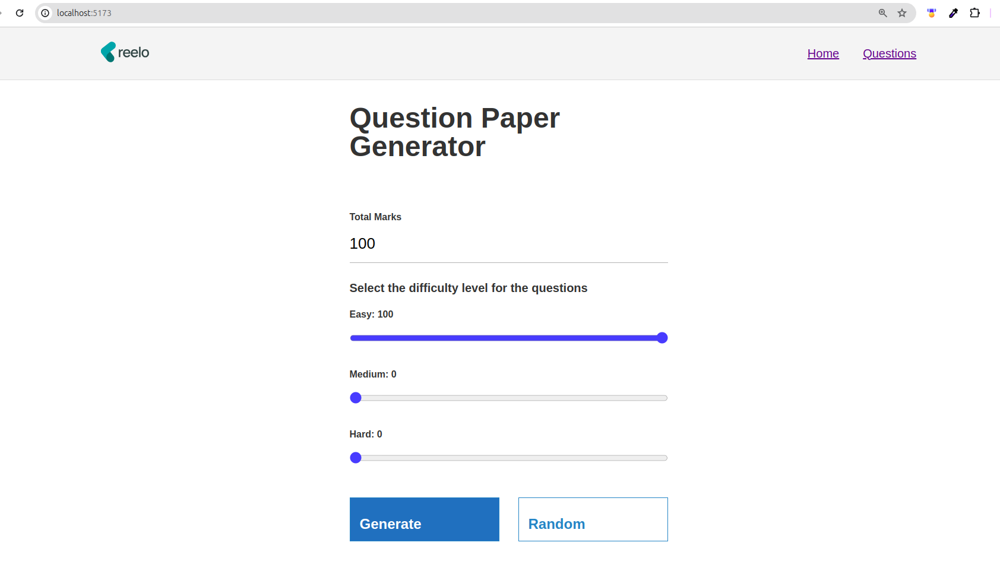
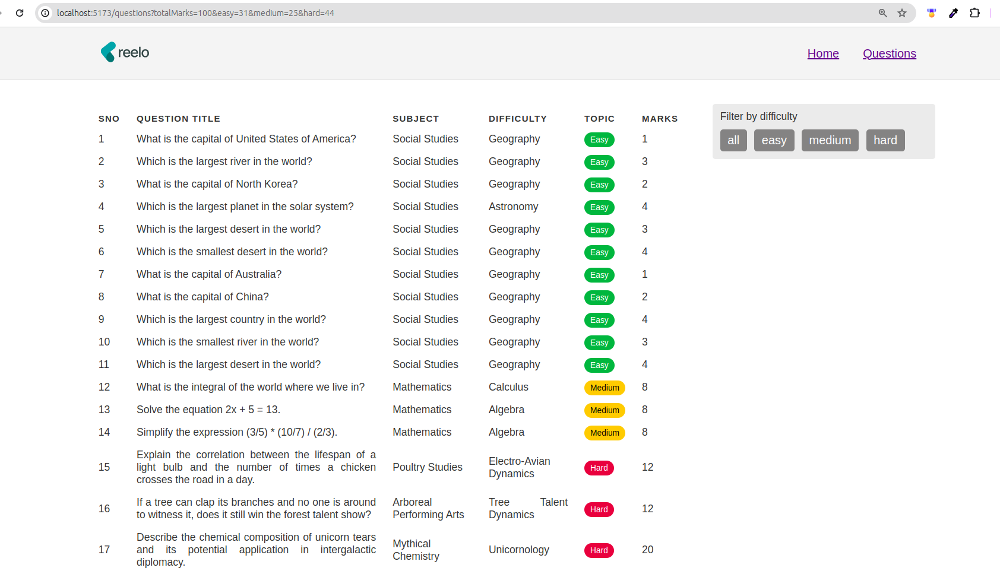
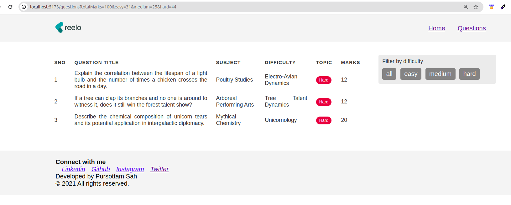

## Question Paper Generator 

### Description
This is a simple javascript based web application which generates a question paper based on the input given by the user. The user can select the give the total marks of questions to be generated and the percentage of difficulty level . The questions are generated randomly from a database of questions. The user can also add questions to the database. The user can also download the question paper in pdf format.

### Live Demo
Please check the link [Question Paper Generator](https://generate-question-paper.netlify.app/)

Note : The backend server is hosted on onrender.com so it may take some time to load the questions.
### Technologies Used
* ReactJS
* NodeJS
* ExpressJS
* ViteJS

### Installation
* Clone the repository

```bash
git clone "https://github.com/Pursottam6003/question-paper-generator"

```
* Install the dependencies

```bash
npm install
```

* Run the frontend server

```bash
npm run dev
```

* Run the backend server

```bash
    cd Backend
    npm install
    npm start 
```

* Open the browser and go to localhost:5173

### Screenshots

1. Home Page



Note : You can customise the percentage of questions by clicking on the sliders and then generate the question paper. or you can click on random button to select random percentage of difficulty 

2. Question Paper

In the question tab the user can filter the questions based on the difficulty level and the subject. The user can also add questions to the database.[to be implemented...]



3. Filter Questions

